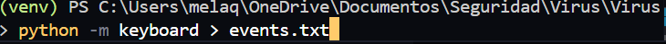
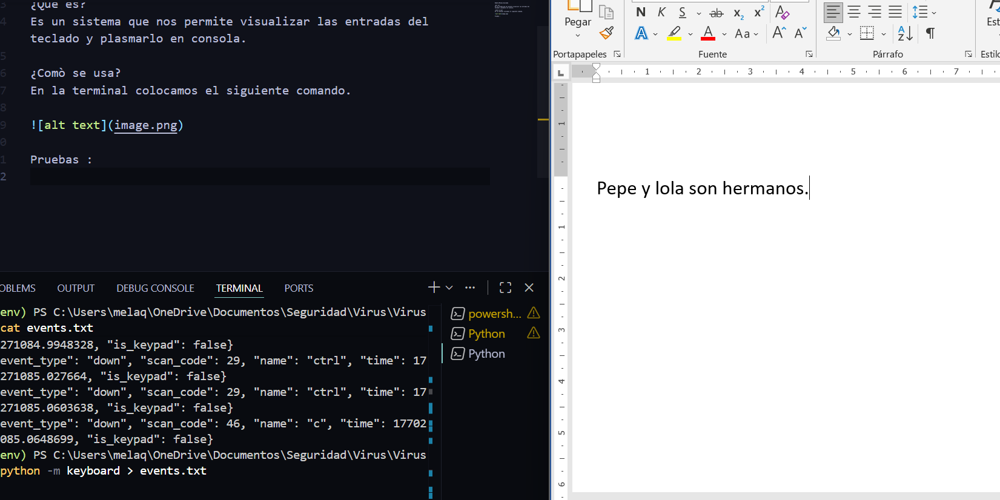
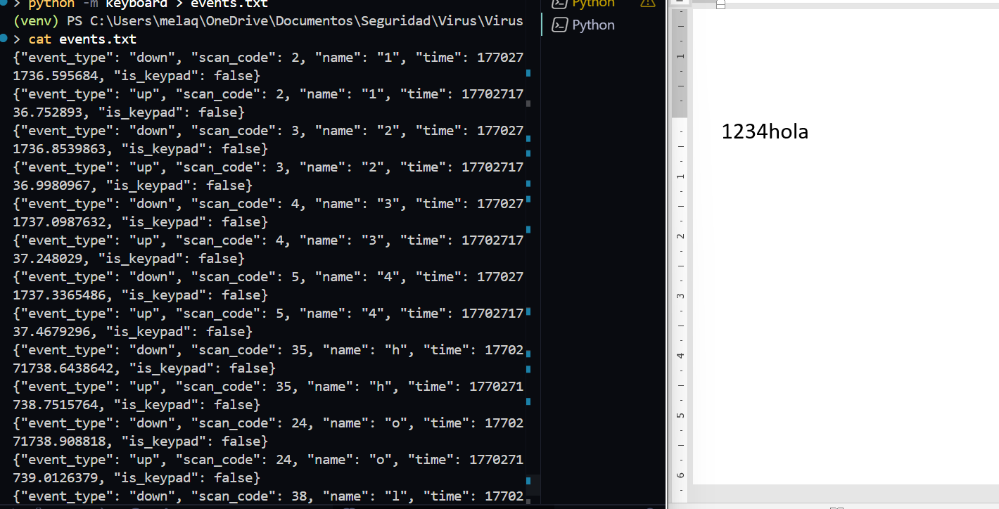

Nombre:Melany Quilumba 

¿Qué es?
Es un sistema que nos permite extraer las entradas del teclado .

¿Comò se usa?
En la terminal colocamos el siguiente comando.

Pruebas :

Usamos el comando de ejecucion.

pausamos el sistema y con el comando cat revisamos el contenido de events.txt

