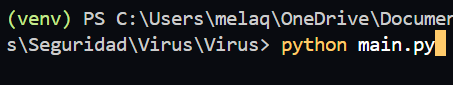
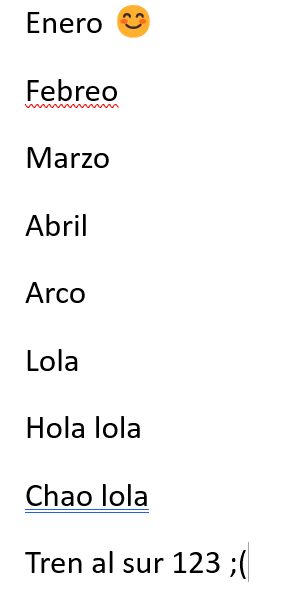
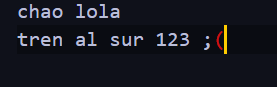
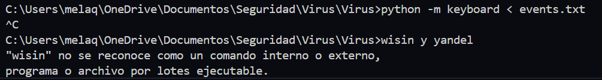

Nombre:Melany Quilumba 

¿Qué es?
Es un sistema que nos permite extraer las entradas del teclado .

¿Comò se usa?
En la terminal colocamos el siguiente comando.

Pruebas :
2.-Para ejecutar el comando usamos.

2.1.-Realizo la prueba 

2.2.-Resultado en un archivo txt.

Intento uno :
Usamos el comando de ejecucion.

pausamos el sistema y con el comando cat revisamos el contenido de events.txt

para el texto completo ejecutamos el siguiente comando 

